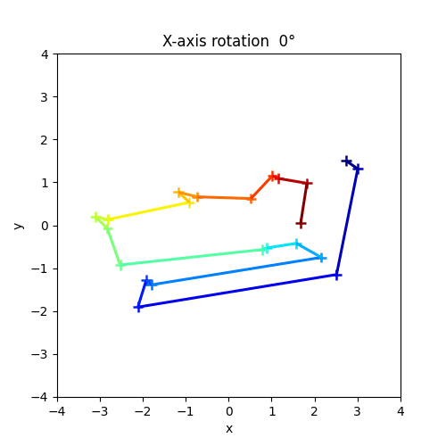
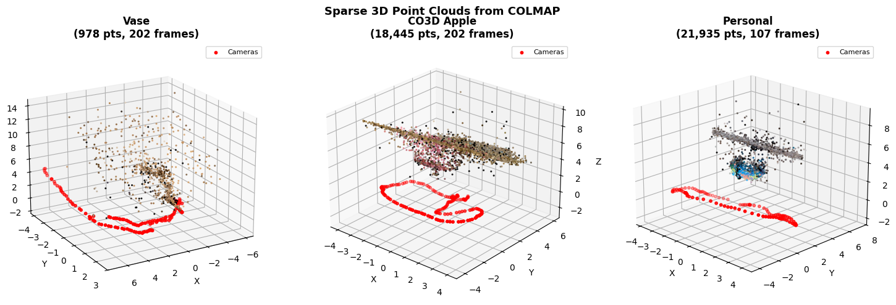
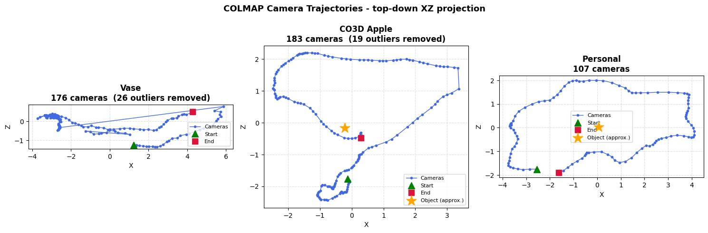
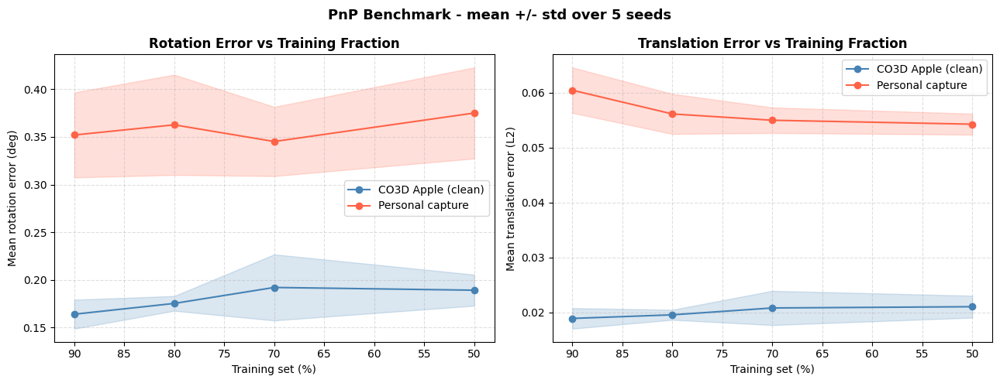
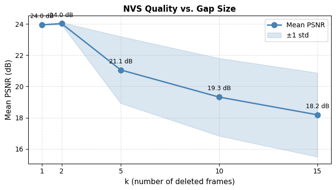
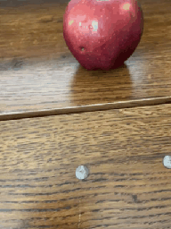

# Computer Vision Lab

Three computer-vision projects from my studies at the University of Haifa, spanning classical multi-view geometry to modern learned representations.

| # | Project | Notebook |
|---|---|---|
| 1 | Metric reconstruction, Structure from Motion, PnP benchmarking, novel view synthesis | `sfm_metric_reconstruction.ipynb` |
| 2 | Few-shot classification with vision foundation models + a custom adapter | `few_shot_foundation_models.ipynb` |
| 3 | Differentiable 2D Gaussian Splatting with PCA initialization | `gaussian_splatting_2d.ipynb` |

Large embedded outputs are cleared so every notebook renders on GitHub; the key figures live in `assets/` and re-running regenerates the rest.

---

## 1. Metric reconstruction & Structure from Motion

**Metric reconstruction from correspondences:** DLT linear triangulation with reprojection-error analysis, centering and normalisation, projection onto the xy-plane, rotation alignment, and an animated reconstruction of the recovered structure.

**Structure from Motion with COLMAP** on three datasets - including a 360° orbit video I captured myself (107 frames, 21,935 triangulated points) and Meta CO3D (202 frames, 18,445 points). A GIF-sourced third dataset is kept as a deliberate failure case study: palette dithering destroys SIFT discriminability (20x fewer points), and the process log walks through the diagnosis.

**PnP pose benchmark:** hold out frames, localize them against the surviving 3D map (SIFT + FLANN 2D-3D correspondences, `solvePnP`), over 2 datasets x 4 training splits x 5 seeds with translation/rotation error metrics. A pre-computed SIFT cache and pooled FLANN index cut the full benchmark from over an hour to under a minute.

**Novel view synthesis on CO3D:** delete every k-th frame and re-synthesize it by forward-warping the nearest surviving neighbor through its depth map - back-project, re-project, z-buffer far-to-near, inpaint disocclusions - evaluated at k = 1, 2, 5, 10, 15 with PSNR, plus an analysis of why middle frames degrade most at high k.

## 2. Few-shot classification with foundation models

Benchmarks frozen vision foundation-model features for few-shot classification, with an N-way ProtoNet sanity benchmark - then beats the baselines with **FSRA (Few-Shot Residual Adapter)**, a small trained adapter over frozen features.

The adapter comes with an architecture and hyperparameter justification, a training-dynamics analysis justifying the 50-epoch budget, and a multi-config sensitivity sweep:

## 3. Differentiable 2D Gaussian Splatting

From eigenspace to Gaussian image space:

- A **differentiable 2D Gaussian renderer** written from scratch: closed-form inverse-covariance (conic) derivation, correctness tests, sanity renders.
- **Single-image optimization** with a learning-rate sweep, a capacity ablation (PSNR vs number of Gaussians), and an analysis of where the Gaussians concentrate.

- **Adaptive density control** - densification and pruning with CPU-grid hyperparameter tuning, compared against the fixed-N baseline on five datasets.
- **PCA / EigenGS-inspired initialization** - a predictor mapping PCA coefficients to Gaussian parameters for one-shot, optimization-free reconstruction, benchmarked against regular splatting for quality, convergence speed, and off-distribution behavior.

---

**Stack:** Python, PyTorch, OpenCV, COLMAP, SIFT/FLANN, NumPy, Matplotlib. **Datasets:** Meta CO3D, personal captures.
